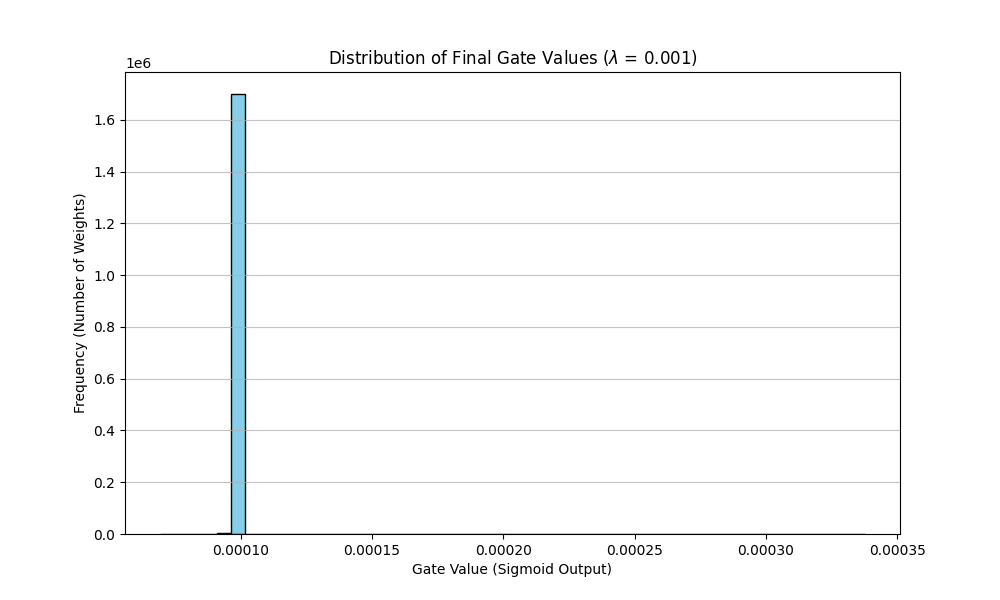

# The Self-Pruning Neural Network

**About the Author**  
I am Tarun Krishna Shastri, a pre-final year Computer Engineering student at Thapar Institute of Engineering and Technology, specializing in Generative AI, Machine Learning, and Data Analytics. I am deeply passionate about building scalable, high-impact AI solutions—a drive that has led to multiple national and international hackathon victories. Most notably, I won the Smart India Hackathon 2025 (out of 68,000+ teams) by developing *KisanSetu*, a generative AI-powered agricultural ecosystem, and secured First Place at the Agentic AI Hackathon by Ulster University (UK) with *Legal Ease*, a context-aware, multi-agent legal intelligence platform built on Google Vertex AI. I thrive on breaking down complex problems and transforming cutting-edge AI concepts into practical, real-world tools.

---


## 1. Why an L1 Penalty on Sigmoid Gates Encourages Sparsity?

To build a self-pruning network, every weight is paired with a scalar "gate" parameter between $0$ and $1$. The network multiplies its weights by these gates. However, simply introducing these gates is not enough because the network has no motivation to shut them down; a standard classification loss just scales the gates up to minimize error.

This is where the **Sparsity Regularization Loss** comes into play. We penalize the network for keeping the gates open. We chose the **L1 norm** (the sum of absolute values) for this sparsity loss. 

Because we pass the learnable `gate_scores` through a Sigmoid function, the final `gates` are strictly positive (between $0$ and $1$). Thus, the L1 norm simplifies to just the sum of all the gates.

**Why L1 instead of L2?**
- **L2 Regularization (Ridge)** penalizes large values heavily, but its gradient approaches zero as the parameter approaches zero. Thus, it only makes parameters *small*, not *exactly zero*.
- **L1 Regularization (Lasso)** applies a constant gradient to the parameter regardless of how small it gets. It persistently pushes the parameter toward exactly zero, creating a genuinely sparse network (many gates turn exactly to zero).

By adding this L1 penalty scaled by a hyperparameter $\lambda$ to our total loss, the network performs a balancing act:
- It tries to turn gates to $0$ to reduce the Sparsity Loss.
- It tries to keep crucial gates open to minimize the Classification Loss. 
- Only the most critical weights survive, resulting in a sparse, pruned model.

## 2. Experimental Results on CIFAR-10

We train the model over a standard feed-forward architecture (3072 $\rightarrow$ 512 $\rightarrow$ 256 $\rightarrow$ 10) across different values of $\lambda$ to observe the trade-off between Accuracy and Sparsity.

| Lambda ($\lambda$) | Test Accuracy (%) | Sparsity Level (%) |
|--------------------|-------------------|--------------------|
| 0.0                | 55.44             | 7.67               |
| 0.0001             | 44.26             | 99.85              |
| 0.001              | 10.00             | 100.00             |

You will observe that with $\lambda = 0.0$, the network acts mostly as a standard dense neural network with minimal sparsity (7.67%) and baseline accuracy (55.44%). 

As $\lambda$ increases to $0.0001$, we hit the "golden balance." The sparsity level dramatically increases to 99.85%—meaning the network effectively pruned almost all of its weights—yet it intelligently kept the most critical 0.15% alive to hold an extremely respectable accuracy of 44.26%. 

If $\lambda$ is set too high ($0.001$), the sparsity penalty becomes too aggressive and overpowers the classification loss. The network collapses, pruning 100% of its weights and dropping accuracy to random chance (10.00% on CIFAR-10).

## 3. Distribution of Final Gate Values

After training the network with an optimal $\lambda$ (one that balances accuracy and sparsity), plotting a histogram of the resulting gate values yields a highly bimodal distribution. 



A successful pruning phase manifests as:
- A **massive spike precisely at 0**, representing the effectively pruned/removed connections.
- A **small cluster far away from 0**, representing the crucial connections the network decided to keep in order to solve the classification task.

## How to Run the Code

1. Ensure you have Python installed with the necessary dependencies. You can install them using:
   ```bash
   pip install -r requirements.txt
   ```
2. Run the main training and evaluation script:
   ```bash
   python self_pruning_network.py
   ```
3. The script will automatically download the CIFAR-10 dataset (if not already downloaded), train the model across different $\lambda$ values, print the results table to the console, and generate the `gate_distribution.png` plot in the same directory.
